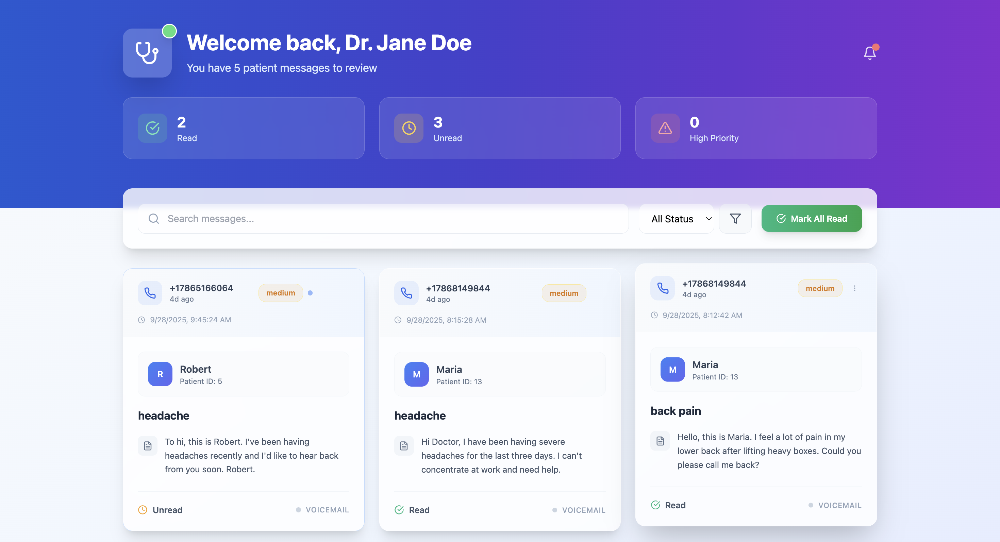

# 🩺 Hackathon Project – CareBridge

## 📌 Overview

This project was developed during **Florida’s Largest Hackathon (FIU)** with the goal of improving communication and efficiency in doctor–patient interactions.

Our solution uses **Natural Language Processing (NLP)** to automatically transcribe, clean, and analyze conversations. The system extracts meaningful insights, generates summaries, and integrates them into a backend for storage and retrieval.

---

## ✨ Features

- 🎙️ **Speech-to-Text**: Convert doctor–patient conversations into transcripts.
- 🧹 **Text Preprocessing**: Normalize, clean, and format transcripts for analysis.
- 🧠 **NLP Analysis**:
  - Summarization of conversations
  - Extraction of key insights (patient name, main reason for consultation, symptoms, treatments, follow-ups)
  - Classification of conversation topics
- 🔗 **Backend Integration**: Node.js + Express server connected to a PostgreSQL database.
- 📡 **API-powered**: Hugging Face Inference API used for NLP models.
- 💻 **Frontend**: [helpmedoctorfast](https://github.com/kianbayzid/helpmedoctorfast) for user interaction and visualization.

---

## 🖼️ Demo Screenshot

Here’s how the dashboard looks when displaying messages extracted from audio conversations, showing the **patient’s name** and the **main reason**:



---

## 🛠️ Tech Stack

- **Frontend**: React (from [helpmedoctorfast](https://github.com/kianbayzid/helpmedoctorfast))
- **Backend**: Node.js, Express
- **Database**: PostgreSQL
- **NLP Models**: Hugging Face Inference API (transformers for summarization & classification)
- **Deployment**: Docker & Docker Compose

---

## 🚀 How It Works

1. User records a doctor–patient conversation.
2. Audio is converted into text.
3. Transcript is normalized (extra spaces, filler words cleaned).
4. NLP models process the text to extract key insights such as patient name and main reason for the consultation.
5. Results are stored in PostgreSQL and served through the Node.js/Express API.
6. The frontend ([helpmedoctorfast](https://github.com/kianbayzid/helpmedoctorfast)) displays the processed data in a clean UI.

---

## ⚡ Quick Start

### Without Docker

```bash
# Clone repo
git clone https://github.com/your-username/doctor-patient-nlp.git

# Install dependencies
cd backend
npm install

# Set environment variables
HUGGINGFACE_API_KEY=your_api_key
DATABASE_URL=postgres://...

# Run server
npm start
```

### With Docker

```bash
# Build and run containers
docker-compose up --build
```

- Backend API → [http://localhost:3000](http://localhost:3000)
- PostgreSQL → running on port `5432`

---

### 📂 Example `docker-compose.yml`

```yaml
version: "3.9"
services:
  backend:
    build: ./backend
    container_name: doctor_nlp_backend
    ports:
      - "3000:3000"
    environment:
      - HUGGINGFACE_API_KEY=${HUGGINGFACE_API_KEY}
      - DATABASE_URL=postgres://postgres:postgres@db:5432/doctor_nlp
    depends_on:
      - db

  db:
    image: postgres:15
    container_name: doctor_nlp_db
    restart: always
    environment:
      POSTGRES_USER: postgres
      POSTGRES_PASSWORD: postgres
      POSTGRES_DB: doctor_nlp
    ports:
      - "5432:5432"
    volumes:
      - pgdata:/var/lib/postgresql/data

volumes:
  pgdata:
```

---

## 👥 Team

Built with ❤️ at Florida’s Largest Hackathon by:

- Valentina Kloster – NLP & Backend Integration
- Kevin Sturge & Kian Bayzid – Frontend & UI
- Aurelio Florez – Project Management & Authentication

---

⚡ _This project was built in under 36 hours during a hackathon, showcasing how NLP can make healthcare interactions more efficient and meaningful._
